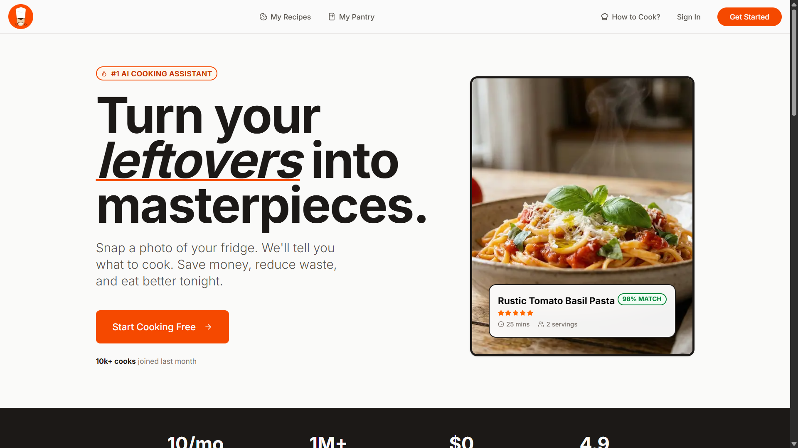
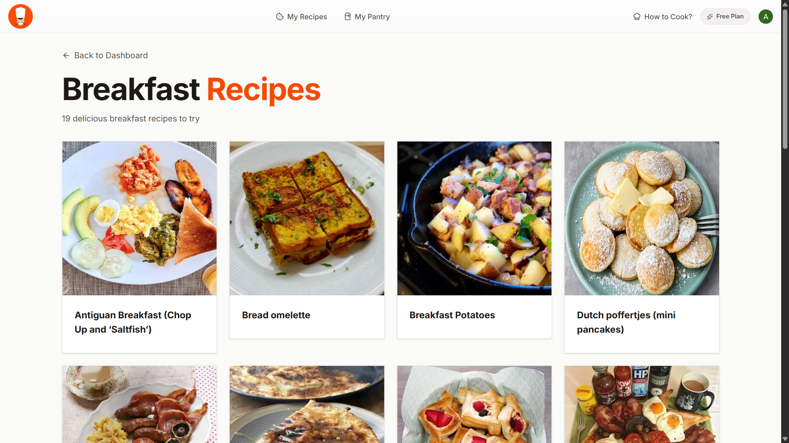
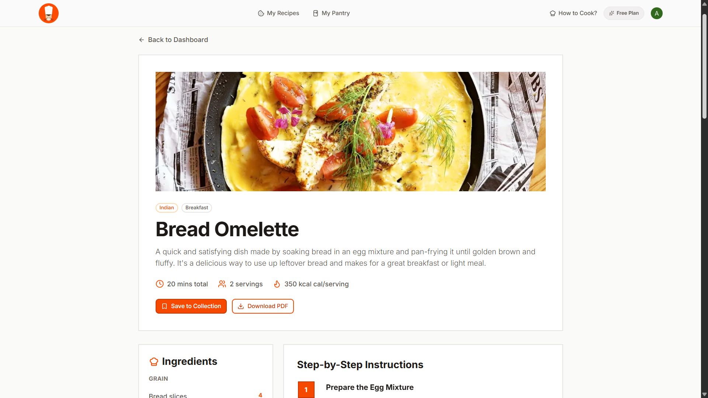
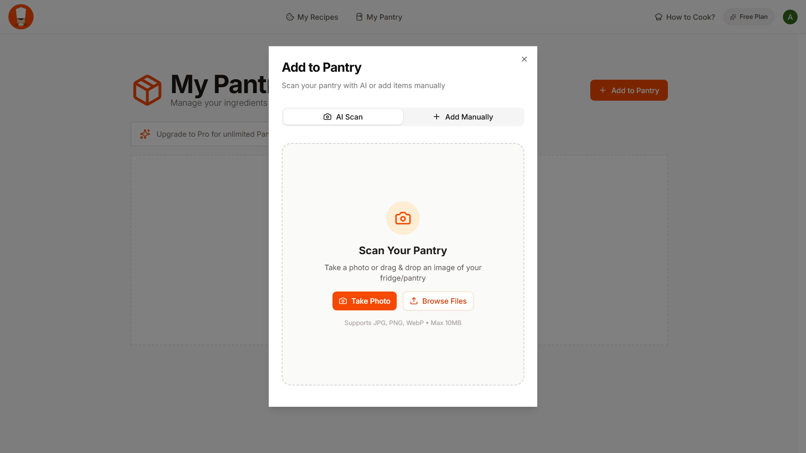
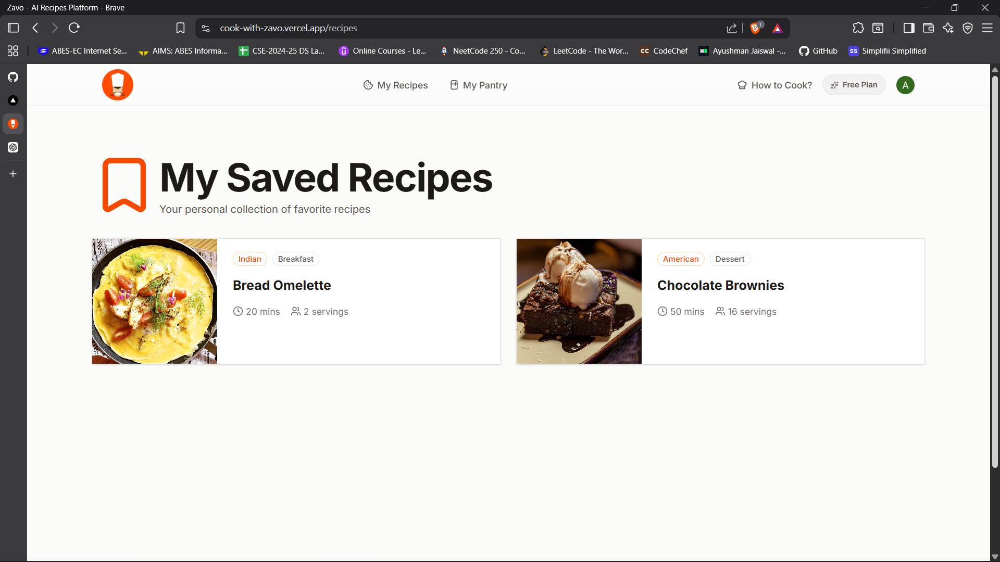
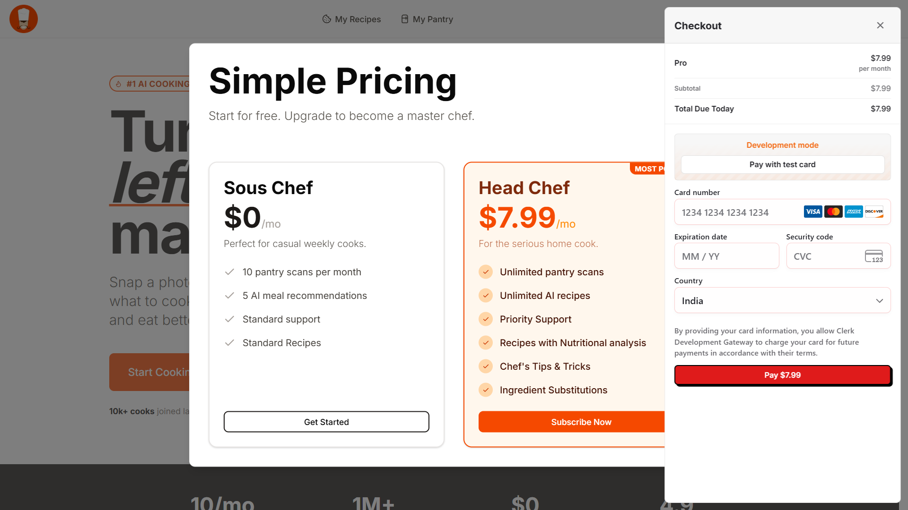

# 🍳 Cook With Zavo

<div align="center">


### AI-Powered Recipe Discovery & Pantry Management Platform

Discover, generate, save, and manage recipes effortlessly using AI. Explore global cuisines, organize pantry ingredients, download recipes as PDFs, and get personalized cooking assistance—all in one modern platform.

### 🚀 Live Demo

https://cook-with-zavo.vercel.app/

### 📂 Repository

https://github.com/Ayushman9889/cook-with-zavo

</div>

---

## 📖 Overview

Cook With Zavo is a full-stack AI-powered recipe platform built to simplify meal planning and cooking.

The platform combines AI recipe generation, pantry management, recipe discovery, secure authentication, PDF exports, and subscription management into a seamless user experience.

---

## ✨ Features

### 🔐 Authentication & User Management

- Secure authentication with Clerk
- Google Sign-In support
- Protected routes
- User profile management
- Personalized user experience
- Subscription and billing integration

### 🤖 AI Recipe Assistant

- Generate recipes using Google Gemini AI
- Ingredient-based recipe recommendations
- AI-powered cooking guidance
- Smart meal suggestions
- Interactive cooking assistance

### 🥘 Pantry Management

- Add pantry ingredients manually
- AI pantry scanning support
- Ingredient organization system
- Pantry-based recipe generation
- Smart ingredient tracking

### 🌍 Recipe Discovery

- Browse recipes by category
- Explore international cuisines
- Recipe of the Day feature
- Detailed recipe pages
- Global recipe collection

### ❤️ Saved Recipes

- Save favorite recipes
- Personal recipe collection
- Quick access to saved meals
- Recipe management system

### 📄 PDF Export

- Download recipes as PDF files
- Printable recipe format
- Offline recipe access

### 💳 Subscription System

- Free and Pro plans
- Clerk Billing integration
- Secure checkout flow
- Premium feature access

### 📱 Modern UI/UX

- Fully responsive design
- Mobile-friendly experience
- Fast loading performance
- Clean and intuitive interface

---

## 🏗️ Architecture

```text
Frontend (Next.js)
        │
        ▼
 Clerk Authentication
        │
        ▼
     Strapi CMS
        │
        ▼
 PostgreSQL (NeonDB)
        │
        ▼
  Google Gemini AI
```

---

## 🛠️ Tech Stack

### Frontend

- Next.js 16
- React 19
- Tailwind CSS
- Shadcn UI
- Radix UI
- Lucide React

### Backend

- Strapi CMS

### Authentication & Billing

- Clerk
- Clerk Billing

### Database

- PostgreSQL
- NeonDB

### AI Integration

- Google Gemini API

### Security

- Arcjet

### Deployment

- Vercel (Frontend)
- Strapi Hosting (Backend)

---

## 📸 Screenshots

### 🏠 Home Page



### 🌍 Explore Recipes



### 🍽️ Recipe Details



### 🥘 Pantry Management



### ❤️ Saved Recipes



### 💳 Subscription & Billing



---

## ⚙️ Local Setup

### Clone Repository

```bash
git clone https://github.com/Ayushman9889/cook-with-zavo.git
cd cook-with-zavo
```

### Frontend Setup

```bash
cd frontend
npm install
npm run dev
```

### Backend Setup

```bash
cd backend
npm install
npm run develop
```

---

## 🔑 Environment Variables

### Frontend (.env.local)

```env
NEXT_PUBLIC_CLERK_PUBLISHABLE_KEY=
CLERK_SECRET_KEY=

NEXT_PUBLIC_STRAPI_URL=

NEXT_PUBLIC_GEMINI_API_KEY=

ARCJET_KEY=
```

### Backend (.env)

```env
DATABASE_CLIENT=postgres

DATABASE_HOST=
DATABASE_PORT=5432

DATABASE_NAME=
DATABASE_USERNAME=
DATABASE_PASSWORD=

DATABASE_SSL=true
```

---

## 📈 Project Highlights

- AI-powered recipe generation using Google Gemini AI
- Secure authentication and subscription management with Clerk
- PostgreSQL database hosted on NeonDB
- Headless CMS architecture with Strapi
- AI-powered pantry scanning workflow
- Recipe PDF export functionality
- Personalized recipe collection system
- Responsive and production-ready UI
- Fully deployed on Vercel

---

## 👨‍💻 Author

### Ayushman Jaiswal

**Full Stack Developer (MERN) | Next.js | React | Node.js | AI Integrations**

- GitHub: https://github.com/Ayushman9889
- LinkedIn: https://www.linkedin.com/in/ayushman-webdev/

---

## ⭐ Support

If you found this project useful, consider giving it a ⭐ on GitHub.

It helps the project reach more developers and supports future improvements.

---

<div align="center">

Made with ❤️ using Next.js, Strapi, Clerk, NeonDB & Gemini AI

</div>